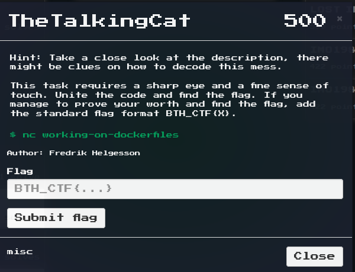
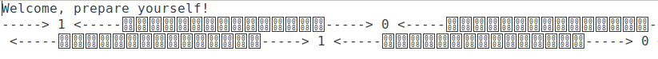

# TheTakingCat
I'm the creator of this challenge and this is my solution to it.

## Description


When connecting to the remote challenge the player is faced with this:


This display of an unmimited amount "random" numbers does not seem to make any sense and the remote server does not seem to respond to any user input.

## Solution
### Step 1 - Recover the data
The first step of this challenge is therefore to make sense of the data by first writing it to a file using:
`nc <address> <port> > test`
Since the output from the server is unlimited this command is stopped after a couple of seconds to see what the output looks like. Reading the file using:
`cat test`
Does not seem to work since the only output is:
```
Welcome, prepare yourself!
```

By opening the file in a texteditor the reason can be seen, the output is filled with scrap data obstructing the file read of "cat".



### Step 2 - Clean the output
The output file is cleaned from all non-digits using Regex and Zed.

`cat test | sed 's/[^0-9]*//g' > output`
The contents of the file "output" are seen below:

```
102541026110257102411025410301102571027910257102691024110243102471025010269102651025310241102691024910261102771024710265102511025010269102651025010270
1025410261102571024110254103011
```

## Step 3 - Decoding 1
The output is repetetive which suggests that a message is repeated by the server. The output looks decoded (also suggested by the hint in the description) but the method is currently unknown.
At this point the best way to go forward is either trying to guess which encoding is used, or take a good look at the description for clues.
The sentence "Find the flag and unite the code" suggests that the string is encoded using "unicode". The string can be decoded using the Decimal to unicode converter on:
https://www.branah.com/unicode-converter
The result of the conversion is seen below:
```
⠎⠕⠑⠁⠎⠽⠑⠧⠑⠝⠁⠃⠇⠊⠝⠙⠍⠁⠝⠉⠕⠥⠇⠙⠋⠊⠝⠙⠊⠞
```
This result looks like Braille (blind writing) and is decoded using online-tools or braille_coded.py seen below the string is decoded.
```
python braille_codec.py -d "⠎⠕⠑⠁⠎⠽⠑⠧⠑⠝⠁⠃⠇⠊⠝⠙⠍⠁⠝⠉⠕⠥⠇⠙⠋⠊⠝⠙⠊⠞"
soeasyevenablindmancouldfindit 
```

## Step 4 - Submit flag
The flag of this challenge is therefore
BTH_CTF{soeasyevenablindmancouldfindit}
