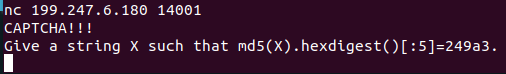
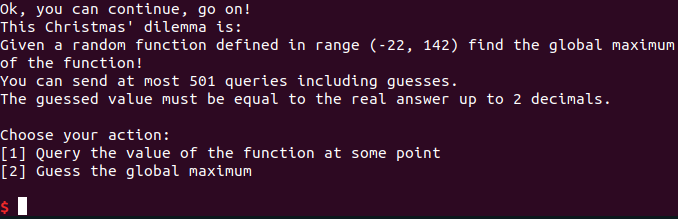
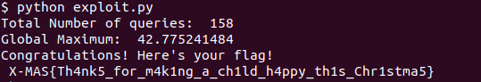

# A Christmas Dilemma
This challenge was divided into two seperate steps were the first on was a CAPTCHA challenge as in several others of the XMAS-CTF challenges.
The CAPTCHA challenge can be seen in the image below.

This challenge was solved by iterating through a wordlist (in this case "rockyou.txt") and generating the corresponding MD5-sum for each word. If the MD5-sum matches the requested CAPTCHA, the correct word is found and sent to the server.
The second part of the challenge was a mathematical problem shown in the image below.

The challenge is to find the global maximum of an unknown functon in a given range. The first thought that came to my mind to solve this challenge was by first requesting the server for the corresponding y value for evenly substituted x-values over the whole range. The plan was to thereafter user these f(x)=y values to estimate the used function using spline interpolation.
It turns out this course of action was fruitless because the resulting global maximum was not meet the required decimal accuracy of the challenge.

The solution of the challenge was to first do a rough approximation of the global maximum by requesting the corresponding y of 20 evenly distributed x:s over the interval.
The highest number returned from the server was interpreted as a very rough approximation of the global maximum of the function. This procedure was repeated multiple time, each time using a finer grain approximation near the maximum of the server.

Let's say for a simple example that the server requests the global maximum in range 5-10.
The results of the rough approximation is seen below.
f(5)=1
f(6)=6
f(7)=7
f(8)=11
f(9)=2
f(10)=3
This result suggests that the global maximum is around x=8.
The next step is to do a finer grain approximation requesting the server for the value the 20 points around x=8 below
f(7.1)
f(7.2)
f(7.3)
...
f(8)
...
f(8.8)
f(8.9)
This procedure is repeated with finer and finer grain approxmation until the total number of queries reach the maximum limit of 500 (Guery 501 is used to perform the final quess)
The X which resulted in the overall highest y value is passed to the server as a guess on the global maximum and the flag below is given

Note that this approximation method is not fail proof and requires several tries to aquire the flag.

This challenge was solved using the script "exploit.py" which is written in python using pwntools.

